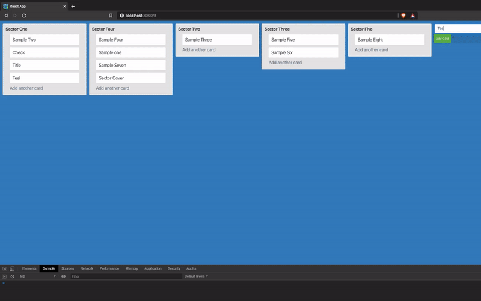

## Building a Trello Clone using React Hooks and GraphQL

This Repository demonstrates how to build a Trello Clone using React Hooks and GraphQL Server.

- This Application use React Smooth Dnd for Trello like Drag and Drop. you can also use `react-beautiful-dnd` or `react-dnd`
- I have implemented GraphQL Subscriptions for real time data. you can skip that if you just want to show the changes only for single user.

### Demo



### Dependencies

### Backend
- graphql
- apollo-server-express
- express
- mongoose

### FrontEnd
- @apollo/react-hooks
- react-smooth-dnd
- styles-components


### To Run the Application

```
  cd server
  npm install
  npm run dev

  cd client
  npm install
  npm run start
```

> Note: I purposely left out the completion of functionality. this app is just to give you an idea how to implement the logic. Feel free to raise a PR and complete the functionalities. it can be a good learning for everyone.